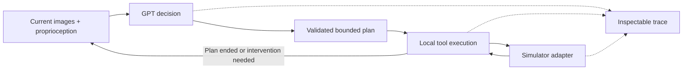

# Embodied Harness

**Let GPT decide at useful boundaries. Inspect everything the robot actually did.**

[中文](README.zh-CN.md) · [Architecture](docs/architecture.md) · [Adapters](docs/adapters.md) · [Validation](docs/validation.md) · [Contributing](CONTRIBUTING.md)

Embodied Harness is a GPT-first runtime for **bounded, interruptible robot tool plans**. A model can submit several operations in one decision. The runtime executes them locally, checks preconditions, and returns control on failure instead of asking the model after every controller tick.

It includes an offline demo, a Responses API planner, four simulator integration paths, and a portable trace viewer with camera observations, tool inputs/results, measured TCP paths and model-call accounting.

> **v0.1 is an engineering alpha, not a benchmark result.** The offline demo is a deterministic kinematic fixture. Initial live API diagnostics reached a MetaWorld goal with one decision, while LIBERO did not complete and repeated API failures occurred. See the [complete attempt log](docs/live-tests/README.md); this is not a success-rate estimate. LIBERO and MetaWorld smoke tests are distinct from task-solving evaluation. RoboCasa and RoboTwin integration status is documented explicitly. No real robot has been validated.

## Try it without an API key or GPU

Python 3.10+:

```bash
git clone https://github.com/pm1255/embodied-harness.git
cd embodied-harness
python -m venv .venv
source .venv/bin/activate
pip install -e .

embodied-harness demo --out runs/batch
embodied-harness view runs/batch
```

Open the printed localhost URL. The viewer needs no frontend build, CDN, or online service. The CLI refuses to overwrite an existing run.

Compare per-tool decisions with one bounded plan, or inspect a failure:

```bash
embodied-harness demo --per-tool --out runs/per-tool
embodied-harness demo --fault-after 12 --out runs/failure
embodied-harness report runs
```

The two successful fixtures execute identical motions with **4 vs 2 deterministic planner decisions**, including the final status decision, and **zero GPT API calls**. This demonstrates scheduling semantics, not improved GPT performance.

## What happens during a run?



The model receives only registered tools. A plan is validated in full before motion begins. It contains 1–8 ordered steps, each with typed arguments and an optional observed boolean precondition. A failure aborts the remaining plan. A new decision sees the actual result and fresh camera frames.

Built-in tools deliberately state their limits:

| Tool | What it does | What it does not establish |
|---|---|---|
| `move_relative` | Closed-loop TCP motion in named robot/world axes; 2/5/10cm presets | Collision-free planning or task completion |
| `move_to_pixel` | Project a fresh visible RGB-D surface pixel and servo to it or 8cm above | Free-space depth, object tracking or a grasp pose |
| `set_gripper` | Issue open/close while holding the TCP position | Successful object grasp |

Orientation is preserved or fixed by the environment. There is no hidden top-down grasp assumption or unimplemented `grasp()` promise. Add validated motion planners, grasp modules or learned policies through the [tool plugin interface](docs/extensions.md).

## Run GPT in a simulator

Install the simulator in its own compatible environment first; see [adapter setup](docs/adapters.md). For MetaWorld:

```bash
pip install -e '.[metaworld]'
embodied-harness smoke --env metaworld --config examples/metaworld.json

# Use a GPT model ID available to your account. No model-access assumption is made.
export OPENAI_API_KEY='your-key'
export OPENAI_MODEL='your-accessible-gpt-model-id'
embodied-harness run --env metaworld --config examples/metaworld.json \
  --task 'Move the gripper to the visible target' --max-decisions 8 \
  --out runs/gpt-metaworld
```

Keys are read from the environment, never from plans. `OPENAI_BASE_URL` is optional. For gateways requiring server-sent events, add `--stream`. An explicit
`--api-mode chat-completions` supports non-streaming compatible gateways; the
client never silently changes protocols or retries paid requests. The client waits for a complete terminal response and never executes partial streamed arguments. The planner uses image inputs, strict function-call schemas, `parallel_tool_calls=false` and `store=false`. It does not access a ChatGPT subscription or reuse a Codex login. The operator supplies a usable API credential and model ID.

The model input consists of current RGB images, robot proprioception, tool specifications and recent execution results. Simulator task success is read by the evaluator after execution; it is not sent to the planner. No demonstration actions, future target depth or annotated object poses are loaded.

| Environment | Entry point | Scope |
|---|---|---|
| LIBERO | `--env libero --config examples/libero.json` | Single Panda, delta OSC, RGB-D surface projection |
| MetaWorld 3.x | `--env metaworld --config examples/metaworld.json` | Sawyer Cartesian control, two RGB-D cameras |
| RoboCasa | `--env robocasa --config examples/robocasa.json` | Adapter for compatible delta OSC configurations; runtime validation required |
| RoboTwin 2 | `--env robotwin --config examples/robotwin.json` | Bridge to an operator-supplied, evaluation-ready task factory; two arms, native EE actions |

These are **not four completed benchmark evaluations**. See [validation evidence](docs/validation.md) before interpreting support. Installing a package or passing a mock test is not evidence of physical task success.

## Traces you can inspect and share

Every run produces:

```text
runs/<run>/
  events.jsonl     # versioned observation / model / plan / tool / control events
  frames/         # content-addressed camera images used by the viewer
  summary.json    # task outcome, infrastructure status, decisions, API calls, tokens
  index.html      # self-contained viewer code and embedded event data
  capture/        # raw adapter captures (can be omitted when sharing a trace)
```

The viewer synchronizes two camera observations, tool inputs/results and a measured TCP path projection. Camera observations are sampled at decision/tool boundaries and periodically during execution; this is not a full-frame-rate video recorder. No chain-of-thought is requested or fabricated.

```bash
embodied-harness export runs/gpt-metaworld   # rebuild viewer after a partial run
embodied-harness report runs                # keep environment/protocol/model groups separate
embodied-harness doctor                     # dependencies and credential presence, no secrets
```

Raw traces contain task text and camera images. Keep private scene recordings out of public repositories. The supplied `.gitignore` excludes runs, keys, weights and datasets.

## Design commitments

- A tool exists only when its backend capability is available.
- No simulator-specific task scripts in the planner.
- No background motion thread abandoned on timeout.
- Per-tool and episode budgets; one executor owns the robot at a time.
- Stale pixel references are rejected after motion. Asking for a fresh observation is preferable to silently reusing stale geometry.
- Model claims, controller completion and environment success are separate fields.
- Runtime errors stay visible instead of becoming benchmark task failures.
- Simulator dependencies are optional; core imports and offline tests need no GPU.

This runtime uses cooperative cancellation at controller-tick boundaries. A blocking native driver must implement its own I/O deadline. The runtime is not a certified safety system, hardware emergency stop, collision planner or real-time controller.

## Development

```bash
pip install -e '.[dev,sim]'
ruff check .
pytest -q
python -m build
```

See [architecture](docs/architecture.md), [extension contracts](docs/extensions.md), [evaluation protocol](docs/evaluation.md) and [contribution guide](CONTRIBUTING.md).

## Roadmap and relationship to existing projects

First validate sensor-only task execution in LIBERO and MetaWorld. Then complete asset-backed RoboCasa and RoboTwin runs, add independently verified grasp/placement skills, and measure GPT calls versus success under a frozen evaluation protocol. A hardware adapter comes only after simulation contracts are exercised.

We draw inspiration from [RPent](https://github.com/RLinf/RPent)'s embodied agent infrastructure. This repository is an independently written, smaller execution-runtime experiment; it makes no performance or novelty claim over RPent. We welcome interoperability rather than incompatible duplicate model and simulator stacks.

The simulator integrations depend on [LIBERO](https://github.com/Lifelong-Robot-Learning/LIBERO), [MetaWorld](https://github.com/Farama-Foundation/Metaworld), [RoboCasa](https://github.com/robocasa/robocasa), [RoboTwin](https://github.com/RoboTwin-Platform/RoboTwin), [robosuite](https://github.com/ARISE-Initiative/robosuite), and MuJoCo. Their code, assets and licenses are separate; none are vendored here.

Code: Apache-2.0. No pretrained weights, training datasets or private experiment recordings are included.
