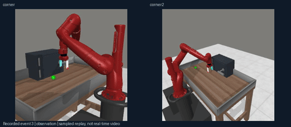
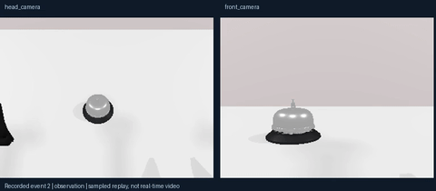
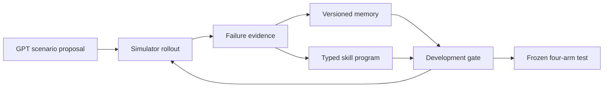
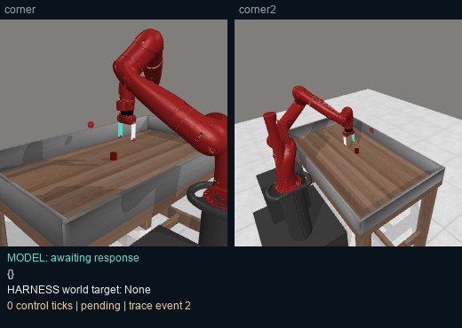
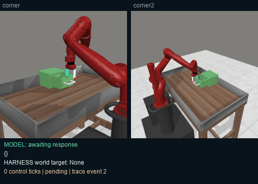
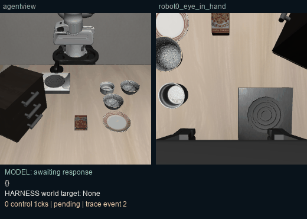
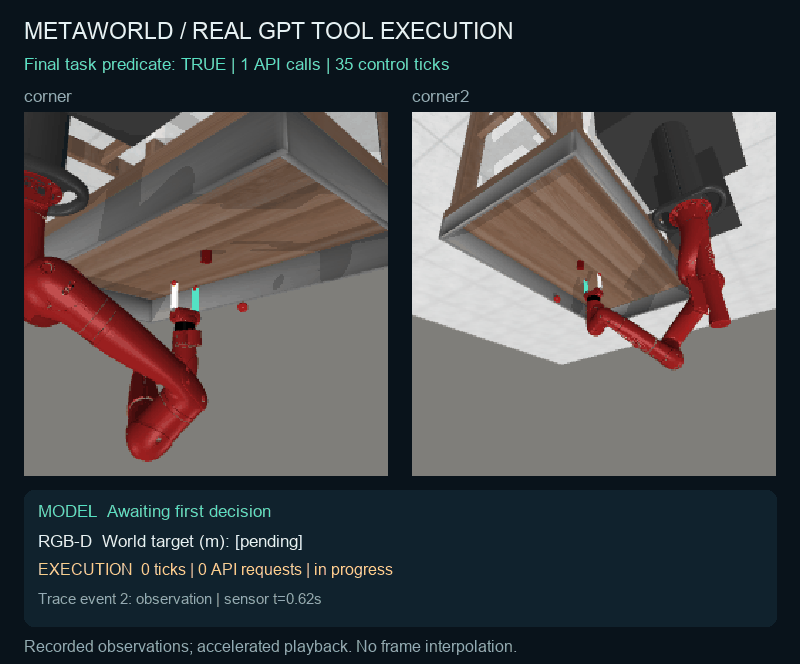
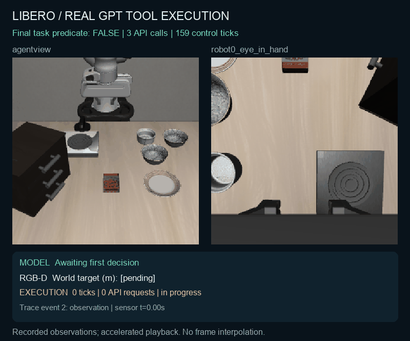
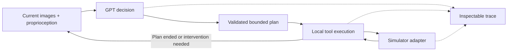

# Embodied Harness

**GPT chooses an action. The harness turns it into robot motion you can inspect.**

[](https://github.com/pm1255/embodied-harness/actions)
[中文](README.zh-CN.md) · [Recorded examples](examples/recorded) · [Design rationale](docs/design-rationale.md) · [Full attempt log](docs/live-tests/all-attempts.json)

A small GPT-first runtime that separates **visual decisions, geometry, local control and evaluation**. The model calls implemented tools instead of generating every controller command. It can submit one primitive or a bounded plan; the executor returns control when the plan ends or a step fails.

## Current direction: master existing benchmarks before generating challenges

**Original tasks → failure decomposition → reuse existing practice → create only missing subtask practice → retest the whole original task.** Harder environments and new challenge tasks unlock only after every task in the frozen scope is reliably mastered.

Environment interventions serve separate robustness, assisted-practice and harder-challenge tracks. Subtask success, easier resets and passing smoke tests never substitute for original-task success.

[Curriculum and environment rules](docs/benchmark-first-rsi.md) · [Curriculum status](https://pm1255.github.io/embodied-harness/rsi/curriculum/) · [186 registered existing tasks](benchmarks/rsi-benchmark-first.json)

The work-order state machine, whole-scope gate, decomposition checks and reuse rules are implemented and tested. A general autonomous consumer with task-specific subgoal checkers and repair execution still needs integration. **The current work order runs no new model or simulator episodes.** The 186-entry inventory includes RoboCasa/RoboTwin subsets and is not a completed benchmark score.

## Historical v1: tasks → failures → memory → skills → held-out tests

The experimental RSI loop lets GPT propose **real simulator scenario configurations**, inspect multimodal development failures, write a versioned `MEMORY.md`, and compile parameterized primitive programs into callable skills. Model weights stay frozen. Candidates must pass a development gate; an independent four-arm test checks whether memory and skills actually help.

**[Open the RSI experiment dashboard](https://pm1255.github.io/embodied-harness/rsi/experiment-v1/)** · [Design and limits](docs/rsi-design.md) · [Frozen-benchmark reproduction](benchmarks/rsi-protocol.md) · [Results and conclusions](docs/rsi/README.md) · [Frontier exploration and stopping rules](docs/frontier-evolution.md) · [Actual π0.5 tool runs](https://pm1255.github.io/embodied-harness/rsi/pi05/)

**Completed pilot:** 72 episodes: 24 development and 48 final-test episodes. No improvement is established.

| Final test | Successes | GPT calls | Infrastructure-error episodes |
|---|---:|---:|---:|
| Baseline | 1/12 | 69 | 3 |
| Memory | 1/12 | 62 | 5 |
| Skills | 0/12 | 61 | 4 |
| Memory + skills | 0/12 | 66 | 3 |

Six adaptively selected native task families, two held-out seeds each. Both candidate bundles were rejected by the development gate. Errors stay in the denominator; lower request counts do not establish greater efficiency when runs fail early. The [full report](docs/rsi/README.md) includes uncertainty and paired comparisons.

| Memory-only door opening: one successful test episode | GPT → π0.5 bell: physical success, later API failure |
|---|---|
| [](https://pm1255.github.io/embodied-harness/rsi/experiment-v1/) | [](https://pm1255.github.io/embodied-harness/rsi/pi05/) |

These are sampled event replays, not real-time video. One success is not evidence of general improvement. [Code release](https://github.com/pm1255/embodied-harness/releases/tag/v0.2.0). The [complete 72-episode frame and trace archive](https://github.com/pm1255/embodied-harness/releases/download/v0.2.0/embodied-harness-rsi-v1-public-evidence-20260924.tar.gz) is public (261 MB; hashes and contents in [the evidence manifest](docs/rsi/evidence-release.json)).



| Component | Implemented behavior |
|---|---|
| Task / scene discovery | Native MetaWorld layout samples, bounded camera yaw and lighting, explicit weakness hypotheses |
| Persistent memory | Task-scoped entries with exact development-episode citations; human-readable revision documents |
| Skill creation | Model-written 1–4-step programs, current-image parameters, validation before motion, stop on failure |
| Specialist delegation | Operator-bound π0.5 RoboTwin qpos14 endpoint; GPT chooses instruction and bounded execution horizon |
| Measurement | Baseline / memory / skills / combined on identical held-out seeds; all failures retained |
| Inspection | Dual-view replay synchronized to model calls, skill expansion, geometry, memory and promotion history |

Inspired by [NVIDIA ASPIRE](https://research.nvidia.com/labs/gear/aspire/); this is an independent small implementation, not an ASPIRE reproduction or a claim of superiority. Generated scenes use existing assets and native task objectives. A functioning loop does not itself demonstrate capability improvement.

```bash
pip install -e '.[metaworld]'
# Work-order inspection only; no API requests. See docs/benchmark-first-rsi.md.
python -m embodied_harness.rsi.curriculum \
  --benchmark benchmarks/rsi-benchmark-first.json \
  --revision my-system-revision --budget-hash my-frozen-protocol \
  --output runs/benchmark-first/next-work.json
```

## Twenty real tasks, two cameras each

**[Open the interactive 20-task replay](https://pm1255.github.io/embodied-harness/benchmarks/basic-20/)** · [All 20 GIFs and exact JSON on GitHub](docs/benchmarks/basic-20/README.md) · [Integration coverage and blockers](docs/benchmarks/README.md)

| Fixed-budget pilot | Tasks | Final task successes | API requests | API-error episodes |
|---|---:|---:|---:|---:|
| MetaWorld | 10 | 3 | 28 | 1 |
| LIBERO Spatial | 10 | 0 | 29 | 2 |

Each task gets at most **3 decisions / 360 control ticks**, single-tool mode, seed 0; LIBERO uses official initial state 0. Every failure is included. **3/20 is a short-pilot result, not an official benchmark score or a matched RPent comparison.** Multi-stage grasping is restricted by both this small budget and the primitive tool set.

| Reach: success | Drawer-close: success | LIBERO: not solved |
|---|---|---|
|  |  |  |

Upside-down MetaWorld cameras are corrected jointly across RGB, depth and calibration. Historical replays rotate presentation only, preserving raw model coordinates. Interface sweeps: **50/50 MetaWorld**, **129/130 LIBERO**; LIBERO-90 task 85 also exhibits unstable physics under native zero-motion actions. Interface completion is not task success.

RoboTwin: **3/3 GPU interface checks passed**; [watch three additional real simulator replays](docs/benchmarks/gpu-smokes/README.md). RoboCasa is still blocked by missing Lightwheel object assets; all nine failed startup attempts are retained.

## Is this better than RPent?

**Not established.** RPent already has VLA execution, geometry tools, memory and multi-environment evaluations. Our narrower goal is a portable execution and measurement kernel for reducing model decisions. Grasp and contact control remain major gaps. Read the [source-backed comparison and required experiments](docs/rpent-comparison.md).

## Measured results, including reliability failures

| Real API example | Plan mode | Final task predicate | API calls | Control ticks | Wall time | Stop reason |
|---|---|---|---:|---:|---:|---|
| MetaWorld `reach-v3`, seed 0 | One primitive | **True** | 1 | 35 | 50.20s | One-decision budget reached |
| LIBERO spatial/task 0, seed 0 | Batch | **False** | 3 | 159 | 107.87s | Third API response failed |

**All eight simulator attempts:** 11 API requests; **7 attempts ended with infrastructure errors**. Five never moved; two moved before a later API failure. One budget-limited episode completed evaluation successfully. These selected engineering examples do not establish a benchmark success rate, a speedup, or a batch-versus-single comparison. The provider advertised `gpt-6-sol`; its upstream identity was not independently verified. [All attempts](docs/live-tests/all-attempts.json) · [Protocol and caveats](docs/live-tests/README.md).

In the successful MetaWorld example, the model request took **49.04s**, while the 35-tick motion tool took **0.21s** on the local synchronous simulator. One model call can drive many control steps, but this example is not fast end-to-end.

## Watch two real API runs

These GIFs play directly on GitHub. They contain recorded dual-camera observations and trace-derived annotations, with accelerated playback and no interpolated robot frames. Yellow rings mark a model-selected pixel **only on its source observation**.

### MetaWorld: one model decision reaches the target



The model chose pixel `[154,137]`. RGB-D projection and local servoing handled the movement. The task predicate was true after a **preselected one-decision budget**; there was no separate model completion verdict. [Exact model arguments and tool results](examples/recorded/metaworld.json).

### LIBERO: a failed attempt exposes missing execution capabilities



The first movement completed, a reused image reference was rejected, and a subsequent surface approach stalled. The third API response failed. The bowl was **not** successfully placed. [Exact plans and failures](examples/recorded/libero.json).

## One complete example: model → geometry → execution

This is the actual MetaWorld function call, not a hand-written policy:

```json
{
  "name": "move_to_pixel",
  "arguments": {
    "arm": "arm",
    "camera": "corner",
    "observation_id": "1a93fb0076f24e13a335d0c33d54ee02:1",
    "pixel": [154, 137],
    "approach": "surface"
  }
}
```

| Stage | Input → output | Who computes it? |
|---|---|---|
| Visual decision | Current images → tool name, camera and pixel `[154,137]` | GPT |
| Geometry | Pixel + current metric depth + camera calibration → `[-0.03683, 0.86508, 0.18571]` m | Harness |
| Local control | Target + current TCP → 35 controller ticks, final target error **7.17mm** | Harness and simulator controller |
| Evaluation | Final simulation state → task predicate **true** | Evaluator; withheld from GPT |

The model did not output that 3D coordinate, joint angles or a dense trajectory. The current tool preserves orientation; the example does **not** demonstrate grasp-pose prediction, collision avoidance or contact control. Observation IDs in recorded JSON belong to that recording and cannot be reused for a new episode.

## Why this harness design is useful

Its current strength is an explicit execution contract and inspectable failures. Higher task success and lower end-to-end latency remain hypotheses to test.

| Design choice | Practical benefit | Evidence today | Boundary |
|---|---|---|---|
| Pixel selection + backend geometry/control | Avoids asking GPT for dense continuous motion parameters | Real pixel → 3D → 35-tick example above | A surface point does not specify a grasp pose |
| Bounded plans, local execution | Several suitable actions can share one model decision | Same-motion offline comparison below | Live GPT call savings not established; stale pixels interrupt batches |
| Typed tools, complete-plan validation | Rejects unsupported tools and malformed plans before motion | [Runtime tests](tests/test_runtime.py) | Valid syntax does not guarantee valid robot behavior |
| Failure stops the remaining plan | Prevents subsequent steps from blindly following a failed movement | LIBERO stale-reference/stall trace; injected-failure tests | Cooperative stop is not collision avoidance or hardware emergency stop |
| Separate model, controller and task outcomes | Reveals whether a failure came from planning, execution or the API | Both real traces and all-attempt log | Provider outages still break the episode |
| Shared tool contract, environment-specific adapters | Keeps simulator action encoding out of the model-facing plan | LIBERO and MetaWorld executed real controls | RoboTwin has three GPU interface checks; RoboCasa remains asset-blocked |

**Scheduling mechanism, tested without GPT:**

| Same offline action sequence | Planner decisions, including finish | Control ticks | Final TCP | GPT API calls |
|---|---:|---:|---|---:|
| One tool per decision | 4 | 28 | Identical | 0 |
| Three tools in one plan | 2 | 28 | Identical | 0 |

This verifies batching semantics, not GPT performance. A VLA can also emit action chunks; reducing model calls is not unique to this design. We have not shown superiority over VLA policies or RPent. The intended advantage is being able to swap perception/control tools and inspect their execution without changing a dense-action model. [Design tradeoffs and experiments needed](docs/design-rationale.md).

## Try it without an API key or GPU

Python 3.10+:

```bash
git clone https://github.com/pm1255/embodied-harness.git
cd embodied-harness
python -m venv .venv
source .venv/bin/activate
pip install -e .

embodied-harness demo --out runs/batch
embodied-harness view runs/batch
```

Open the printed localhost URL. The viewer needs no frontend build, CDN, or online service. The CLI refuses to overwrite an existing run. To inspect the recorded real API examples without making new API calls:

```bash
embodied-harness view docs/live-tests
```

GitHub displays the GIFs above; it does not execute repository HTML. This command opens the full interactive recordings locally.

Compare per-tool decisions with one bounded plan, or inspect a failure:

```bash
embodied-harness demo --per-tool --out runs/per-tool
embodied-harness demo --fault-after 12 --out runs/failure
embodied-harness report runs
```

The two successful fixtures execute identical motions with **4 vs 2 deterministic planner decisions**, including the final status decision, and **zero GPT API calls**. This demonstrates scheduling semantics, not improved GPT performance.

## What happens during a run?



The model receives only registered tools. A plan is validated in full before motion begins. It contains 1–8 ordered steps, each with typed arguments and an optional observed boolean precondition. A failure aborts the remaining plan. A new decision sees the actual result and fresh camera frames.

Built-in tools deliberately state their limits:

| Tool | What it does | What it does not establish |
|---|---|---|
| `move_relative` | Closed-loop TCP motion in named robot/world axes; 2/5/10cm presets | Collision-free planning or task completion |
| `move_to_pixel` | Project a fresh visible RGB-D surface pixel and servo to it or 8cm above | Free-space depth, object tracking or a grasp pose |
| `set_gripper` | Issue open/close while holding the TCP position | Successful object grasp |

Orientation is preserved or fixed by the environment. There is no hidden top-down grasp assumption or unimplemented `grasp()` promise. Add validated motion planners, grasp modules or learned policies through the [tool plugin interface](docs/extensions.md).

## Run GPT in a simulator

Install the simulator in its own compatible environment first; see [adapter setup](docs/adapters.md). For MetaWorld:

```bash
pip install -e '.[metaworld]'
embodied-harness smoke --env metaworld --config examples/metaworld.json

# Use a GPT model ID available to your account. No model-access assumption is made.
export OPENAI_API_KEY='your-key'
export OPENAI_MODEL='your-accessible-gpt-model-id'
embodied-harness run --env metaworld --config examples/metaworld.json \
  --task 'Move the gripper to the visible target' --max-decisions 8 \
  --out runs/gpt-metaworld
```

Keys are read from the environment, never from plans. `OPENAI_BASE_URL` is optional. For gateways requiring server-sent events, add `--stream`. An explicit
`--api-mode chat-completions` supports non-streaming compatible gateways; the
client never silently changes protocols or retries paid requests. The client waits for a complete terminal response and never executes partial streamed arguments. The planner uses image inputs, strict function-call schemas, `parallel_tool_calls=false` and `store=false`. It does not access a ChatGPT subscription or reuse a Codex login. The operator supplies a usable API credential and model ID.

The model input consists of current RGB images, robot proprioception, tool specifications and recent execution results. Simulator task success is read by the evaluator after execution; it is not sent to the planner. No demonstration actions, future target depth or annotated object poses are loaded.

| Environment | Entry point | Scope |
|---|---|---|
| LIBERO | `--env libero --config examples/libero.json` | Single Panda, delta OSC, RGB-D surface projection |
| MetaWorld 3.x | `--env metaworld --config examples/metaworld.json` | Sawyer Cartesian control, two RGB-D cameras |
| RoboCasa | `--env robocasa --config examples/robocasa.json` | Adapter for compatible delta OSC configurations; runtime validation required |
| RoboTwin 2 | `--env robotwin --config examples/robotwin.json` | Three native-source GPU interface checks passed; wheel factory still experimental |

These are **not four completed benchmark evaluations**. See [validation evidence](docs/validation.md) before interpreting support. Installing a package or passing a mock test is not evidence of physical task success.

## Traces you can inspect and share

Every run produces:

```text
runs/<run>/
  events.jsonl     # versioned observation / model / plan / tool / control events
  frames/         # content-addressed camera images used by the viewer
  summary.json    # task outcome, infrastructure status, decisions, API calls, tokens
  index.html      # self-contained viewer code and embedded event data
  capture/        # raw adapter captures (can be omitted when sharing a trace)
```

The viewer synchronizes two camera observations, tool inputs/results and a measured TCP path projection. Camera observations are sampled at decision/tool boundaries and periodically during execution; this is not a full-frame-rate video recorder. No chain-of-thought is requested or fabricated.

```bash
embodied-harness export runs/gpt-metaworld   # rebuild viewer after a partial run
embodied-harness report runs                # keep environment/protocol/model groups separate
embodied-harness doctor                     # dependencies and credential presence, no secrets
```

Raw traces contain task text and camera images. Keep private scene recordings out of public repositories. The supplied `.gitignore` excludes runs, keys, weights and datasets.

## Design commitments

- A tool exists only when its backend capability is available.
- No simulator-specific task scripts in the planner.
- No background motion thread abandoned on timeout.
- Per-tool and episode budgets; one executor owns the robot at a time.
- Stale pixel references are rejected after motion. Asking for a fresh observation is preferable to silently reusing stale geometry.
- Model claims, controller completion and environment success are separate fields.
- Runtime errors stay visible instead of becoming benchmark task failures.
- Simulator dependencies are optional; core imports and offline tests need no GPU.

This runtime uses cooperative cancellation at controller-tick boundaries. A blocking native driver must implement its own I/O deadline. The runtime is not a certified safety system, hardware emergency stop, collision planner or real-time controller.

## Development

```bash
pip install -e '.[dev,sim]'
ruff check .
pytest -q
python -m build
```

See [architecture](docs/architecture.md), [extension contracts](docs/extensions.md), [evaluation protocol](docs/evaluation.md) and [contribution guide](CONTRIBUTING.md).

## Roadmap and relationship to existing projects

First validate sensor-only task execution in LIBERO and MetaWorld. Then complete asset-backed RoboCasa and RoboTwin runs, add independently verified grasp/placement skills, and measure GPT calls versus success under a frozen evaluation protocol. A hardware adapter comes only after simulation contracts are exercised.

We draw inspiration from [RPent](https://github.com/RLinf/RPent)'s embodied agent infrastructure. This repository is an independently written, smaller execution-runtime experiment; it makes no performance or novelty claim over RPent. We welcome interoperability rather than incompatible duplicate model and simulator stacks.

The simulator integrations depend on [LIBERO](https://github.com/Lifelong-Robot-Learning/LIBERO), [MetaWorld](https://github.com/Farama-Foundation/Metaworld), [RoboCasa](https://github.com/robocasa/robocasa), [RoboTwin](https://github.com/RoboTwin-Platform/RoboTwin), [robosuite](https://github.com/ARISE-Initiative/robosuite), and MuJoCo. Their code, assets and licenses are separate; none are vendored here.

Code: Apache-2.0. No pretrained weights, training datasets or private experiment recordings are included.
