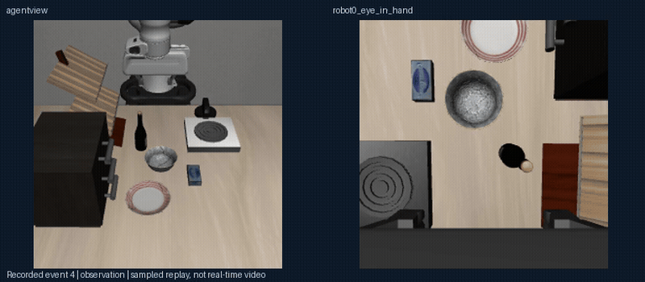
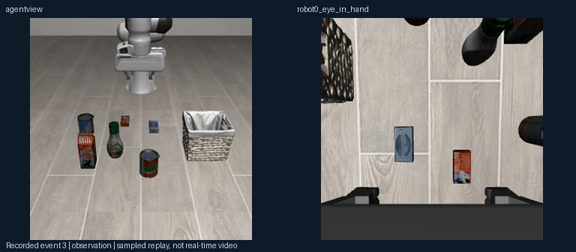
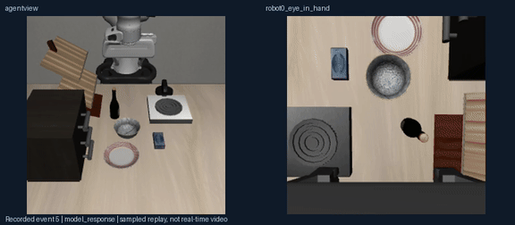

# Embodied Harness

**GPT 操作机器人，改写工具与技能，并为每次能力改进留下可核验的证据。**

[](https://github.com/pm1255/embodied-harness/actions)
[English](README.md) · [真实调用 JSON](examples/recorded) · [设计依据](docs/design-rationale.md) · [全部实测记录](docs/live-tests/all-attempts.json)

框架把**视觉决策、几何工具、VLA 控制、独立评价**分开。GPT 可以调用已有工具，也可以编写组合这些工具的受限程序。修复循环保留记忆、skill、源码修改、被拒绝的版本和配对机器人回放。下方实测使用 LIBERO 与 π0.5；更广的课程和环境适配能力另列状态，不混作已完成的成绩。

## 模型实际改写工具：三轮结果与全部历史

**[打开进化可视化：性能、真实改动、48 段双视角回放](https://pm1255.github.io/embodied-harness/rsi/program-evolution/)** · [协议、成本与限制](docs/rsi/program-evolution/README.md)

实验模型先写出受限 Python 工具，再依据失败的开发验证修改记忆、skill 和工具说明。模型权重、成功判据和执行预算保持一致。各轮使用新的配对初始状态；留出结果没有反馈给提案模型。

| 版本 | 实际改动 | 开发成功：原版 → 候选 | 开发 GPT 调用 | 留出成功 | 留出 GPT 调用 | 开发决定 |
|---|---|---|---|---|---|---|
| 1 | 写持续调用 VLA 的工具，用于抽屉 | 4/4 → 4/4 | 15 → 14 | 3/4 → 4/4 | 19 → 20 | 未晋级 |
| 2 | 保留程序，修改记忆/skill/说明，扩展到碗放置 | 4/4 → 4/4 | 16 → 16 | 4/4 → 4/4 | 18 → 17 | 未晋级 |
| 3 | 保留程序，扩展声明适用范围到汤罐放置 | 3/4 → 4/4 | 22 → 11 | 3/4 → 4/4 | 19 → 10 | 通过小样本开发门槛 |

第三版留出调用减少 **47%**，输入 token **39,271→29,987**，记录到的耗时 **293.5→206.0 秒**；控制步数增加 **616→703**。这是四任务小样本结果，不能宣称完成整个 benchmark、轨迹更短或优于 RPent。记忆、skill 和工具组合测试，尚无单模块归因。前两轮被拒绝的版本与回放都保留。**目前任务难度没有增加。**

第三版实际的抽屉任务调用，GPT 没有输出位姿或关节轨迹：

```json
{
  "tool": "program_bounded_full_goal_delegation",
  "arguments": {"instruction": "open the middle drawer of the cabinet"}
}
```

[模型写出的程序](docs/rsi/program-evolution/program.py)持续调用 π0.5，动作块之间读取新观测；固定的原生评价器在任务成功时停止动作。



上图是第一版的加速抽样回放。网页展示 `program_bounded_full_goal_delegation` 的模型参数、内部 `run_vla` 参数、当前 VLA 动作块及真实 7 维控制动作。单个成功例子不表示第一版整体通过。

[提前冻结的八任务确认实验](benchmarks/libero-program-eight-task-confirmation.json)已完成：开发集 **1/8 → 8/8**，留出集 **0/8 → 6/8**。基线有 8 个接口异常回合，候选有 1 个；这些端到端结果不能单独衡量模型能力。扩展开发门槛因基线接口异常未通过，第三版只保留此前四任务范围内的接受记录。更难任务尚未解锁。

**强执行基线：同样八项任务 × 两个状态**

| 执行方式 | 原生成功 | 执行器记录 GPT 调用 | 接口异常回合 |
|---|---:|---:|---:|
| 独立 π0.5 | 15/16 | 0 | 0 |
| 原始 GPT＋工具 | 1/16 | 146 | 8 |
| 第三版 GPT＋工具 | 14/16 | 25 | 1 |

[打开全部 48 个同状态对照回放](https://pm1255.github.io/embodied-harness/rsi/program-evolution/matched-reference/)。第三版**尚未超过强 VLA 基线**：一个长任务失败同样出现在独立 π0.5 中，另一个失败是决策服务超时。改善脆弱的原始调度不等于产生新的操作能力。补充对照在查看扩展结果前冻结，不改变原来的晋级规则。

**实际基线已完成：** [观看 LIBERO 全部 16 个配对回合](https://pm1255.github.io/embodied-harness/rsi/baseline/)，使用 GPT-6 Astra 与官方 LIBERO π0.5 权重。[参考方案、实现与限制](docs/baseline-and-evolution.md)。

| 八项原始任务、固定开发状态 | 原生成功 | GPT 调用 | 控制步 | 接口异常 |
|---|---:|---:|---:|---:|
| 单独 π0.5 | 7/8 | 0 | 2,017 | 0 |
| GPT + π0.5 与几何工具 | 6/8 | 53 | 1,864 | 0 |

GPT 修复了一项策略失败，但在抽屉任务造成回归，并在一个双物体任务上提前宣布完成。这给出了具体的调度修复目标，**不能据此判断 GPT 的能力上限**。八项域内任务、每项一个状态，不是完整 benchmark、未见任务泛化成绩，也不是优于 RPent 的证据。此前三次决策的试验协议不同，不能当作进化前的可比基线。

| GPT 修复汤罐入篮失败 | GPT 调度未能打开抽屉 |
|---|---|
| [](https://pm1255.github.io/embodied-harness/rsi/baseline/) | [](https://pm1255.github.io/embodied-harness/rsi/baseline/) |

上图为加速的双视角抽样事件回放。页面可查看准确的模型参数、工具展开、原生结果和全部配对回合。

## 当前路线：先完成 benchmark，再逐步突破能力边界

**已有任务 → 失败分解 → 检索并复用已有练习 → 仅补建缺失子任务 → 回测完整原任务。全部已选任务稳定掌握后，再改变环境提高难度、设计新任务。**

环境变化分为原任务泛化评测、缺失子任务练习和进阶挑战，分别记分。子任务成功、简化环境成功和接口 smoke 通过，都不能替代原任务成功。

[查看课程与环境变化规则](docs/benchmark-first-rsi.md) · [课程状态页](https://pm1255.github.io/embodied-harness/rsi/curriculum/) · [186 个已登记任务清单](benchmarks/rsi-benchmark-first.json)

已实现并测试调度状态机、整套任务晋级门槛、分解检查和复用规则。新的 LIBERO 路径接通了模型编写记忆、skill 和受限 Python 工具，再用新状态配对验证的流程。任意 harness 源码修改、跨所有环境的子任务执行仍未完成。186 是登记范围，RoboCasa/RoboTwin 为子集，不能当作已跑完的成绩。

## 历史 v1：任务生成、记忆与技能对照实验

新增的 RSI 实验允许 GPT 提出场景配置，在真实仿真中尝试，依据开发回合生成 `MEMORY.md` 和可调用技能，再用冻结测试集检查效果。**大模型权重不更新；改进来自显式经验和技能，是否有效由实验决定。**

**[打开 RSI 实验可视化](https://pm1255.github.io/embodied-harness/rsi/experiment-v1/)** · [结果与结论](docs/rsi/README.md) · [系统设计](docs/rsi-design.md) · [复测冻结 benchmark](benchmarks/rsi-protocol.md) · [能力边界、吸收与停滞判据](docs/frontier-evolution.md) · [π0.5 实测回放](https://pm1255.github.io/embodied-harness/rsi/pi05/)

**已完成 72 回合：24 个开发回合 + 48 个独立测试回合。当前没有证明能力提升。**

| 独立测试 | 成功 | GPT 次数 | 基础设施错误 |
|---|---:|---:|---:|
| 基础工具 | 1/12 | 69 | 3 |
| 加记忆 | 1/12 | 62 | 5 |
| 加技能 | 0/12 | 61 | 4 |
| 记忆 + 技能 | 0/12 | 66 | 3 |

两轮候选均未通过开发准入。包含所有接口失败；失败提前结束造成的调用减少，不能当作效率提升。六个任务族各两个测试种子，样本不足以证明能力上限。[完整结论与区间](docs/rsi/README.md)。

| 记忆组开门：一次成功的测试回合 | GPT → π0.5 按铃：物理成功，后续 API 失败 |
|---|---|
| [](https://pm1255.github.io/embodied-harness/rsi/experiment-v1/) | [](https://pm1255.github.io/embodied-harness/rsi/pi05/) |

动图为抽样事件回放，不是实时录像。单次成功不代表整体提升。[代码发布页](https://github.com/pm1255/embodied-harness/releases/tag/v0.2.0)。[72 回合完整观测帧与执行记录](https://github.com/pm1255/embodied-harness/releases/download/v0.2.0/embodied-harness-rsi-v1-public-evidence-20260924.tar.gz)已公开（261 MB；[文件清单与校验值](docs/rsi/evidence-release.json)）。

| 模块 | 现在实际做的事 |
|---|---|
| 场景与任务生成 | 选择原生 MetaWorld 任务实例、视角和光照，写出要验证的能力短板 |
| 记忆 | 按任务检索，关联确切开发回合，保存 Markdown 版本 |
| 技能 | 模型生成 1–4 步参数化原语程序，运行前校验，失败即停 |
| π0.5 | 通过固定权重、明确动作合同的工具执行局部动作块 |
| 验证 | 无记忆无技能 / 只有记忆 / 只有技能 / 两者都有，使用相同测试场景和预算 |
| 可视化 | 双视角视频、模型参数、工具展开、控制目标、记忆证据和技能准入结果 |

参考 [NVIDIA ASPIRE](https://research.nvidia.com/labs/gear/aspire/)，没有把已有方法包装成原创，也没有宣称优于 ASPIRE 或 RPent。当前场景生成基于既有资产与原生任务目标；不是任意 3D 场景生成。开发集通过与独立测试提升分别报告。

## 20 个真实任务与双视角回放

**[打开 20 任务交互网页](https://pm1255.github.io/embodied-harness/benchmarks/basic-20/)** · [GitHub 内查看全部 20 条动图与原始 JSON](docs/benchmarks/basic-20/README.md) · [基础接口覆盖表](docs/benchmarks/README.md)

| 本轮固定预算试跑 | 任务数 | 最终任务成功 | API 调用 | API 错误回合 |
|---|---:|---:|---:|---:|
| MetaWorld | 10 | 3 | 28 | 1 |
| LIBERO Spatial | 10 | 0 | 29 | 2 |

每任务最多 **3 次决策 / 360 个控制步**，单工具模式，seed 0；LIBERO 使用官方初始状态 0。全部失败保留，3/20 是该短预算试跑的结果，**不是官方 benchmark 成绩，也不是与 RPent 的公平对比**。抓取等多阶段任务明显受预算与现有工具能力限制。

| Reach：成功 | Drawer-close：成功 | LIBERO：未完成 |
|---|---|---|
|  |  |  |

MetaWorld 的倒置画面已修正：新评测同步旋转 RGB、深度和相机标定；历史回放只修正显示，原始模型坐标不改写。基础接口检查：MetaWorld **50/50**，LIBERO **129/130**；LIBERO-90 task 85 的物理不稳定在原生零动作下也能复现。基础接口通过不等于任务成功。

RoboTwin：**3/3 单卡接口检查通过**，[新增三条真实仿真回放](docs/benchmarks/gpu-smokes/README.md)。RoboCasa 仍缺 Lightwheel 物体资产，九条启动失败均保留，不能称为四环境 benchmark 已全部完成。

## 与 RPent 的真实差异

目前没有证据证明我们优于 RPent。它已有 VLA 执行、几何工具、记忆和多环境成绩。我们的定位是可复用的执行与评测内核，探索减少模型调用；稳定调度、广泛任务验证与可靠失败恢复仍需完善。见[逐项对比与验证标准](docs/rpent-comparison.md)。

## 较早的两条诊断记录

| 真实 API 任务 | 决策方式 | 最终任务判据 | API 调用 | 控制步 | 总耗时 | 停止原因 |
|---|---|---|---:|---:|---:|---|
| MetaWorld `reach-v3`，seed 0 | 单工具 | **成功** | 1 | 35 | 50.20 秒 | 达到预设的一次决策预算 |
| LIBERO spatial/task 0，seed 0 | 批量计划 | **未成功** | 3 | 159 | 107.87 秒 | 第三次 API 响应失败 |

**全部 8 次仿真尝试共发出 11 次 API 请求，其中 7 次尝试以接口错误结束。**5 次未执行动作，2 次已执行动作后又遇到接口错误，剩余 1 次预算内执行满足任务判据。这些是调试过程中选择的例子，不能据此宣称成功率、泛化能力或批量规划优于单工具。模型名称为 AiXor 返回的 `gpt-6-sol`，未独立核验上游模型身份。[所有尝试](docs/live-tests/all-attempts.json) · [实验条件](docs/live-tests/README.md)。

MetaWorld 成功例子中，模型请求花了 **49.04 秒**，35 个控制步对应的工具执行花了 **0.21 秒**。一次推理驱动多个控制步已经跑通，但总耗时仍然不快。

## 直接看真实例子

下面的双视角动图可以在 GitHub 首页直接播放。画面来自实际仿真观测，文字来自执行日志；播放经过加速，没有插值或生成机器人画面。黄色圆圈只在对应的原始观测上标出模型选择的像素。

### MetaWorld：一次模型决策到达目标


模型选择 `[154,137]`，harness 用当前深度和相机标定恢复三维目标，控制器完成移动。预先固定一次决策预算后，环境判定成功；模型没有另行输出完成判断。[查看完整调用与工具结果](examples/recorded/metaworld.json)。

### LIBERO：失败例子说明我们还缺什么


第一段移动完成，第二步复用了旧图像而被拒绝；重新观测后，表面接近停滞，第三次 API 响应失败。**抓碗放盘没有成功。**[查看原始计划、像素坐标和失败结果](examples/recorded/libero.json)。

## 完整例子：模型到底输出什么，harness 做什么？

下面来自真实模型输出，不是手写策略：

```json
{
  "name": "move_to_pixel",
  "arguments": {
    "arm": "arm",
    "camera": "corner",
    "observation_id": "1a93fb0076f24e13a335d0c33d54ee02:1",
    "pixel": [154, 137],
    "approach": "surface"
  }
}
```

| 阶段 | 输入 → 输出 | 负责者 |
|---|---|---|
| 视觉决策 | 当前图像 → 工具名、相机和像素 `[154,137]` | GPT |
| 几何恢复 | 像素 + 当前深度 + 相机标定 → `[-0.03683, 0.86508, 0.18571]` 米 | harness |
| 连续控制 | 三维目标 + 当前末端位置 → 35 个控制步，最终距表面目标 **7.17mm** | harness 与仿真控制器 |
| 任务评价 | 最终仿真状态 → 任务判据为真 | 独立评价器，不传给 GPT |

模型没有输出这里的三维坐标、关节角或密集轨迹。当前工具保持姿态，这个例子没有证明抓取姿态预测、避障或接触控制已经完成。JSON 中的观测 ID 只对这段记录有效，不能拿到新任务里直接执行。

## 为什么采用这样的 harness？

当前能说明的价值是**降低模型和控制器的耦合，让每一步的输入、执行和失败可检查**。尚未证明总体成功率更高，也未证明比 VLA 更快。

| 设计 | 解决的具体问题 | 现有证据 | 当前限制 |
|---|---|---|---|
| 模型选像素，底层做几何与控制 | 不要求 GPT 输出大量连续运动参数 | 上面的真实像素 → 三维 → 35 步执行 | 表面点不等于抓取姿态 |
| 有界批量计划 | 合适的多个动作可以共用一次决策 | 下表的相同动作离线对照 | 尚无真实 GPT 的配对收益；旧像素会中断计划 |
| 工具类型约束、执行前校验完整计划 | 不存在的工具和错误参数不能直接开始运动 | [执行器测试](tests/test_runtime.py) | 参数合法不等于动作一定合理 |
| 失败后中止后续步骤 | 接近失败后不会盲目继续抓取、搬运 | LIBERO 实测和故障注入测试 | 协作式停止不能代替避障和硬件急停 |
| 分开记录模型判断、工具完成、环境成功 | 能定位规划、控制、接口分别出了什么问题 | 成功与失败记录都保留 | API 不稳定仍会打断任务 |
| 共用工具接口，隔离环境动作编码 | 模型侧不用直接处理各环境的底层动作向量 | LIBERO、MetaWorld 已实际执行控制 | RoboCasa、RoboTwin 仍需真实资产环境验证 |

**已验证的调度机制，不涉及 GPT 性能：**

| 相同离线动作序列 | 决策次数，含结束判断 | 控制步 | 最终末端位置 | GPT 调用 |
|---|---:|---:|---|---:|
| 每次决策一个工具 | 4 | 28 | 相同 | 0 |
| 一次计划三个工具 | 2 | 28 | 相同 | 0 |

VLA 也能输出动作块，因此“减少调用”不是本项目独有的能力。本项目希望提供可替换的感知/控制工具，以及能复查的执行接口。是否优于某种 VLA 或 RPent，需要同任务、同预算的对照实验，目前没有这项证据。

**下一步真正需要补强的地方：**带有效性检查的持久目标表示、抓取姿态和接触控制工具、碰撞规划，以及稳定的 API 执行与恢复策略。它们还没有实现，不能只在提示词里写一个 `grasp()` 就算支持。[设计取舍与所需实验](docs/design-rationale.md)。

## 无需 API、GPU 即可运行

```bash
git clone https://github.com/pm1255/embodied-harness.git
cd embodied-harness
python -m venv .venv
source .venv/bin/activate
pip install -e .
embodied-harness demo --out runs/batch
embodied-harness view runs/batch
```

查看已经记录的真实双视角交互回放，无需再次调用模型：

```bash
embodied-harness view docs/live-tests
```

GitHub 不直接执行仓库里的 HTML，所以首页使用 GIF，完整交互页面通过上面的本地命令打开。

重现离线调度对照与故障处理：

```bash
embodied-harness demo --per-tool --out runs/per-tool
embodied-harness demo --fault-after 12 --out runs/failure
embodied-harness report runs
```

## 连接 GPT 与仿真器

```bash
pip install -e '.[metaworld]'
export OPENAI_API_KEY='你的密钥'
export OPENAI_MODEL='你的账号可访问的GPT模型ID'
embodied-harness run --env metaworld --config examples/metaworld.json \
  --task 'Move the gripper to the visible target' --out runs/gpt-metaworld
```

`--plan-mode single` 每次直接调用一个原始工具；`--plan-mode batch` 提交有序计划。兼容网关可显式选择 `--stream` 或非流式 `--api-mode chat-completions`。框架不隐藏重试，也不复用 ChatGPT/Codex 登录凭证。[实测运行参数](docs/live-tests/README.md) · [环境安装](docs/adapters.md)。

| 环境 | 实际验证状态 |
|---|---|
| MetaWorld | 双视角 RGB-D、控制接口、一个真实 GPT 到达目标例子 |
| LIBERO | 官方初始状态、π0.5 / GPT 配对基线与模型修改验证；尚非完整 benchmark |
| RoboCasa | 已有适配代码，尚未完成资产环境验证 |
| RoboTwin | 三项 GPU 接口检查与 π0.5 工具已执行；不是完整 benchmark |
| 真机机器人 | 尚无已验证适配器 |

## 已实现的工具与边界

| 工具 | 实际作用 | 不包含的能力 |
|---|---|---|
| `move_relative` | 沿机器人/世界坐标轴移动 2、5、10cm | 碰撞规划 |
| `move_to_pixel` | 投影当前可见表面点，移动到该点或上方 8cm | 空中点深度、抓取姿态、物体跟踪 |
| `set_gripper` | 保持末端位置并开合夹爪 | 自动确认抓取成功 |
| `run_vla` | 固定权重 π0.5 从当前图像和机器人状态生成动作块，分块重观测 | 任意模型自动兼容、任务必然成功 |
| `program_*` | 执行模型编写且通过准入的受限 Python 工具，组合已有原语 | 任意 Python、修改评价器、无限循环 |

模型输入只有当前图像、机器人自身状态、可用工具和近期执行结果。不会读取专家轨迹、未来位置、物体真值或环境成功判据。当前已接通固定权重的 LIBERO / RoboTwin π0.5 工具；MoveIt、SLAM、GraspNet 仍需通过[工具扩展接口](docs/extensions.md)实现并验证。

代码为 Apache-2.0。参考并致谢 [RPent](https://github.com/RLinf/RPent)；本项目不声称性能或原创性超越它。[验证状态](docs/validation.md) · [贡献指南](CONTRIBUTING.md)。
