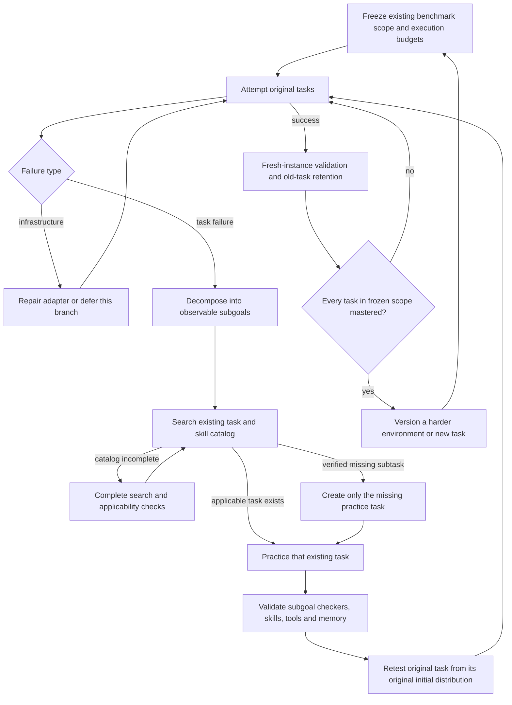

# Benchmark-first RSI: solve, decompose, practice, return

The main curriculum starts from **existing benchmark tasks**. It does not begin by asking the model to invent tasks. The controller keeps the original benchmark objective as the final test of every repair.



## What changed from the historical experiment

The published 72-episode v1 experiment generated six scene families before attempting them. Its results remain immutable historical evidence. **That task-generation-first protocol is no longer the recommended development route.** Nothing in the new controller is presented as a completed new robot experiment.

`rsi.curriculum.BenchmarkCurriculum` implements the benchmark-first work-order state machine, whole-scope mastery gate, decomposition validation, task reuse rule and environment-change classification. It is tested library code. The work-order CLI does **not** invoke a model, robot, task generator or arbitrary generated Python. Existing benchmark execution is provided separately by `scripts/run_benchmark.py`. A fully autonomous consumer connecting every work order to task-specific subgoal checkers, skill repair and scene construction is still integration work; the state machine alone is not evidence of self-improvement.

## Existing task scope comes first

`benchmarks/rsi-benchmark-first.json` registers 186 existing task entries from this project's interface manifests: 50 MetaWorld, 130 LIBERO, 3 RoboCasa and 3 RoboTwin. RoboCasa and RoboTwin are **subsets**, not exhaustive official suites. Interface checks are not task mastery. This manifest is a frozen task inventory, not a claimed 186-task result or an official standardized evaluation protocol.

Before executing a new experiment, bind native success evaluators, allowed initial-state distributions, model/harness revision, per-episode and total budgets, and independent development/validation/final-test partitions. The sample work order deliberately uses an unmeasured revision and a pending budget identifier. It cannot qualify any task as mastered.

Unavailable adapters stay in the scope and are reported as blocked. The scheduler can defer a blocked branch and work on others, but cannot silently remove it to unlock harder tasks. Expanding or narrowing the scope requires a new manifest/version and cannot rewrite the denominator of an old claim.

## Decomposition must resolve observable failures

For a failed pick-and-place task, a **proposed** decomposition might be:

| Subgoal | Observable exit condition | What a repair may change |
|---|---|---|
| Reach an approach pose | Tool reaches a collision-free pregrasp region | Pixel targeting / approach tool |
| Establish a grasp | Object follows a small lift, or a validated contact check passes | Grasp tool / specialist policy |
| Transport while holding | Object remains held during movement | Motion skill / tool parameters |
| Release at the destination | Object is supported in the goal region | Placement skill |

These descriptions are not implemented sensor checkers or successful demonstrations. Each actual decomposition needs a bounded dependency DAG, a failure trace, a current revision, and registered checker bindings. Missing checkers cause an `implement_or_bind_subgoal_checkers` work order. A node marked `validated: true` by the proposing model is ignored; separate evaluator reports, bound to the exact decomposition hash and checker, must verify practice.

Before creating a practice task, search the existing indexed catalog. `resolve_practice` matches explicit `practice_for` contracts, not loose task-name similarity. An incomplete catalog produces `complete_catalog_search`, never permission to invent a task. A real catalog gap permits a narrowly scoped missing-subtask practice environment linked to the failed parent. It does not permit unrelated exploration.

After practice, run the **whole original task** again. Do not initialize the robot midway, insert an object into its gripper, relax collision physics, or replace the original success predicate for that retest. Those interventions may be useful practice scaffolds, but their scores remain separate. Individually successful subgoals do not establish successful composition.

## Environment changes serve three different purposes

| Purpose | When allowed | How scored |
|---|---|---|
| Original-task robustness evaluation | During the existing-task stage | Preserve the goal; record position/appearance/view interventions and use fresh evaluation instances. Report modified-environment results separately from the original benchmark. |
| Missing-subtask practice | After an original-task failure, decomposition and verified catalog gap | An assisted-practice track. Easier resets, reduced clutter or staged initial states never grant original-task mastery. |
| Harder challenges / new goals | After every task in the frozen scope meets the mastery criterion | A newly versioned challenge track with feasibility checks; keep regression testing the original scope. |

Changes inside an official benchmark's allowed reset distribution can remain part of that benchmark's protocol. Changes outside it must be labeled as a robustness/stress track. The environment constructor cannot decide that its own modified goal is equivalent; evaluator definitions and intervention metadata are controlled outside the task-proposing model.

## “All tasks are done well” is a per-task condition

The configurable default gate requires fresh original-task validation for the **current** model/harness revision, a matching task definition and budget, native evaluation, multiple distinct physical initial states and at least two evaluation rounds. The initial sample floor is 20 total instances, with a per-round floor and success-rate check. All tasks need a success lower bound of at least 0.8; Wilson bounds are adjusted across the task scope using Bonferroni. Infrastructure failures stay in the denominator, with a separate reliability threshold.

Twenty trials are a floor, not sufficient evidence by themselves. At 186 tasks, the simultaneous bound is deliberately conservative and usually requires more observations. Repeated API calls on an identical initial state cannot inflate the distinct-instance count. A strong average cannot hide a permanently failed task, and one good round cannot conceal a tiny failed second round.

Use a predeclared validation schedule when making inferential claims. These bounds are not an anytime-valid guarantee under arbitrary repeated peeking. Original task success, robustness success, assisted-practice success and harder-challenge success are separate curves.

## Measure how far RSI gets

Track all of the following against cumulative wall time, API tokens/requests and simulator steps:

- How much of the fixed original task scope meets the mastery criterion.
- Which failed stages become reliable and whether that transfers back to full original tasks.
- Regressions in previously mastered tasks after memory, skill, tool, harness or model changes.
- How far the mastered system transfers across environment interventions.
- Only after the original scope is mastered: the maximum validated challenge difficulty reached.

A stalled original task first triggers decomposition or a different repair class. A blocked branch remains visible and can be deferred; it does not unlock unrelated new challenges. Existing conservative local-plateau checks still apply to fresh paired repair evidence. Budget exhaustion and unavailable tools remain separate from a demonstrated lack of progress.

## Inspect or integrate the controller

```bash
python -m embodied_harness.rsi.curriculum \
  --benchmark benchmarks/rsi-benchmark-first.json \
  --revision my-model-and-harness-revision \
  --budget-hash my-frozen-execution-protocol-hash \
  --output runs/benchmark-first/next-work.json
```

This writes a work order, not a rollout. An empty evidence set returns `attempt_original` and keeps new challenge generation disabled. Supply `--evidence` with trusted development/validation records as execution progresses. Final held-out records are rejected as adaptive inputs.

Preserve the work orders, task/decomposition graph, catalog search, environment diffs, tool/memory/skill versions, rejected proposals, original-task retests, evaluator traces and costs in the existing evolution archive. Human engineering changes and changes proposed by the experiment brain must retain distinct attribution.
