# Twenty-task GPT pilot

All 20 planned attempts, including failures. Three model decisions / 360 control ticks per task. Seed 0; LIBERO official initial state 0. Single-tool mode, gpt-6-sol via AiXor. This is a short pilot, not an official benchmark result. GIFs are accelerated observation playback; no interpolated frames. Provider routing metadata omitted; model arguments and tool results preserved.

[Interactive 20-task selector](index.html) · [machine-readable report](report.json)

| Task | Outcome | API calls | Control ticks |
|---|---|---:|---:|
| [metaworld-reach-v3-s0](metaworld-reach-v3-s0/index.html) | SUCCESS | 3 | 52 |
| [metaworld-push-v3-s0](metaworld-push-v3-s0/index.html) | NOT SOLVED | 3 | 0 |
| [metaworld-pick-place-v3-s0](metaworld-pick-place-v3-s0/index.html) | NOT SOLVED | 3 | 49 |
| [metaworld-door-open-v3-s0](metaworld-door-open-v3-s0/index.html) | NOT SOLVED | 3 | 318 |
| [metaworld-drawer-open-v3-s0](metaworld-drawer-open-v3-s0/index.html) | ERROR | 1 | 0 |
| [metaworld-drawer-close-v3-s0](metaworld-drawer-close-v3-s0/index.html) | SUCCESS | 3 | 94 |
| [metaworld-button-press-v3-s0](metaworld-button-press-v3-s0/index.html) | SUCCESS | 3 | 87 |
| [metaworld-peg-insert-side-v3-s0](metaworld-peg-insert-side-v3-s0/index.html) | NOT SOLVED | 3 | 165 |
| [metaworld-window-open-v3-s0](metaworld-window-open-v3-s0/index.html) | NOT SOLVED | 3 | 321 |
| [metaworld-window-close-v3-s0](metaworld-window-close-v3-s0/index.html) | NOT SOLVED | 3 | 360 |
| [libero_spatial-00-s0](libero_spatial-00-s0/index.html) | NOT SOLVED | 3 | 177 |
| [libero_spatial-01-s0](libero_spatial-01-s0/index.html) | NOT SOLVED | 3 | 208 |
| [libero_spatial-02-s0](libero_spatial-02-s0/index.html) | NOT SOLVED | 3 | 167 |
| [libero_spatial-03-s0](libero_spatial-03-s0/index.html) | NOT SOLVED | 3 | 125 |
| [libero_spatial-04-s0](libero_spatial-04-s0/index.html) | ERROR | 2 | 99 |
| [libero_spatial-05-s0](libero_spatial-05-s0/index.html) | NOT SOLVED | 3 | 139 |
| [libero_spatial-06-s0](libero_spatial-06-s0/index.html) | NOT SOLVED | 3 | 163 |
| [libero_spatial-07-s0](libero_spatial-07-s0/index.html) | ERROR | 3 | 236 |
| [libero_spatial-08-s0](libero_spatial-08-s0/index.html) | NOT SOLVED | 3 | 172 |
| [libero_spatial-09-s0](libero_spatial-09-s0/index.html) | NOT SOLVED | 3 | 189 |

### metaworld-reach-v3-s0

SUCCESS · 3 API calls · [raw trace](metaworld-reach-v3-s0/events.jsonl)

### metaworld-push-v3-s0

NOT SOLVED · 3 API calls · [raw trace](metaworld-push-v3-s0/events.jsonl)

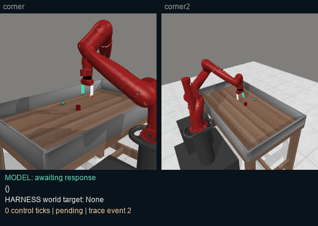

### metaworld-pick-place-v3-s0

NOT SOLVED · 3 API calls · [raw trace](metaworld-pick-place-v3-s0/events.jsonl)

### metaworld-door-open-v3-s0

NOT SOLVED · 3 API calls · [raw trace](metaworld-door-open-v3-s0/events.jsonl)

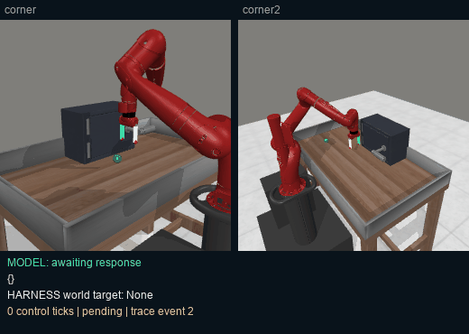

### metaworld-drawer-open-v3-s0

ERROR · 1 API calls · [raw trace](metaworld-drawer-open-v3-s0/events.jsonl)

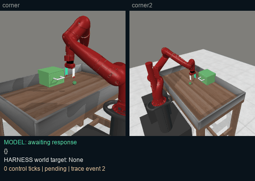

### metaworld-drawer-close-v3-s0

SUCCESS · 3 API calls · [raw trace](metaworld-drawer-close-v3-s0/events.jsonl)

### metaworld-button-press-v3-s0

SUCCESS · 3 API calls · [raw trace](metaworld-button-press-v3-s0/events.jsonl)

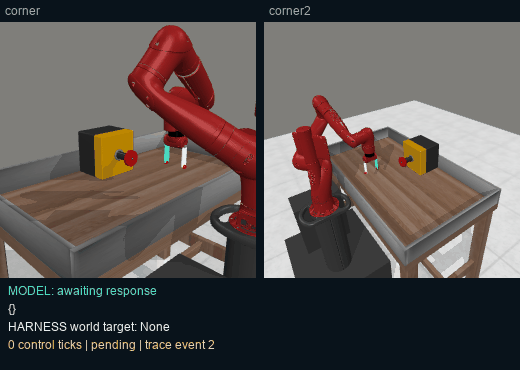

### metaworld-peg-insert-side-v3-s0

NOT SOLVED · 3 API calls · [raw trace](metaworld-peg-insert-side-v3-s0/events.jsonl)

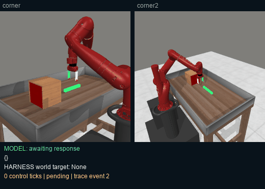

### metaworld-window-open-v3-s0

NOT SOLVED · 3 API calls · [raw trace](metaworld-window-open-v3-s0/events.jsonl)

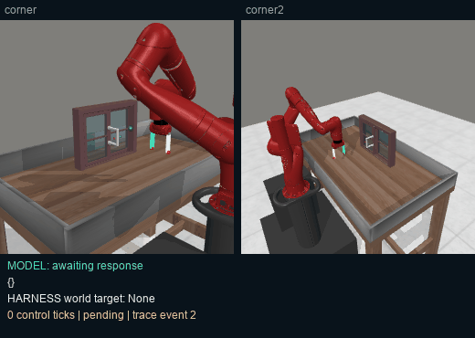

### metaworld-window-close-v3-s0

NOT SOLVED · 3 API calls · [raw trace](metaworld-window-close-v3-s0/events.jsonl)

### libero_spatial-00-s0

NOT SOLVED · 3 API calls · [raw trace](libero_spatial-00-s0/events.jsonl)

### libero_spatial-01-s0

NOT SOLVED · 3 API calls · [raw trace](libero_spatial-01-s0/events.jsonl)

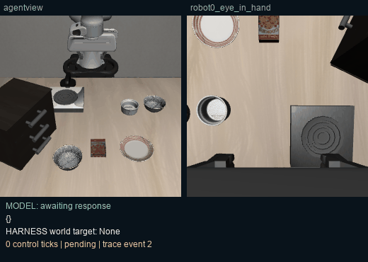

### libero_spatial-02-s0

NOT SOLVED · 3 API calls · [raw trace](libero_spatial-02-s0/events.jsonl)

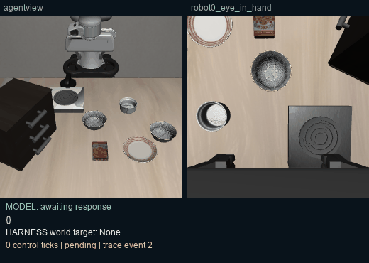

### libero_spatial-03-s0

NOT SOLVED · 3 API calls · [raw trace](libero_spatial-03-s0/events.jsonl)

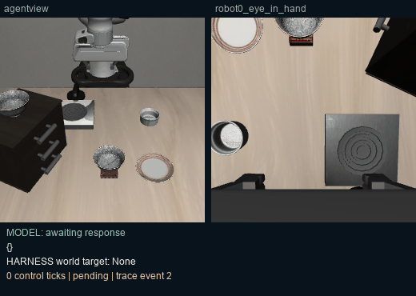

### libero_spatial-04-s0

ERROR · 2 API calls · [raw trace](libero_spatial-04-s0/events.jsonl)

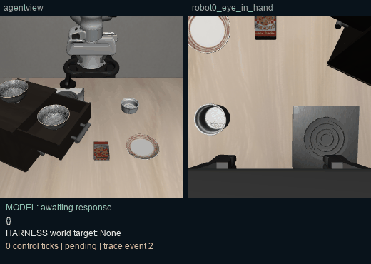

### libero_spatial-05-s0

NOT SOLVED · 3 API calls · [raw trace](libero_spatial-05-s0/events.jsonl)

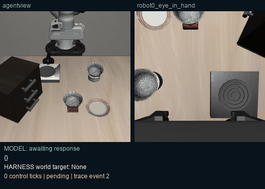

### libero_spatial-06-s0

NOT SOLVED · 3 API calls · [raw trace](libero_spatial-06-s0/events.jsonl)

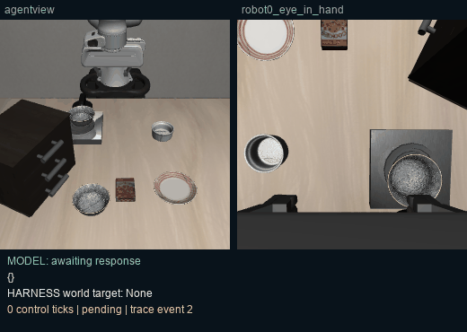

### libero_spatial-07-s0

ERROR · 3 API calls · [raw trace](libero_spatial-07-s0/events.jsonl)

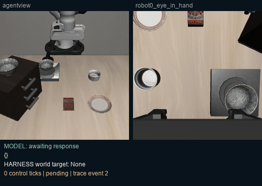

### libero_spatial-08-s0

NOT SOLVED · 3 API calls · [raw trace](libero_spatial-08-s0/events.jsonl)

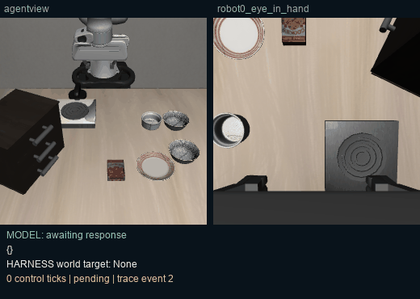

### libero_spatial-09-s0

NOT SOLVED · 3 API calls · [raw trace](libero_spatial-09-s0/events.jsonl)

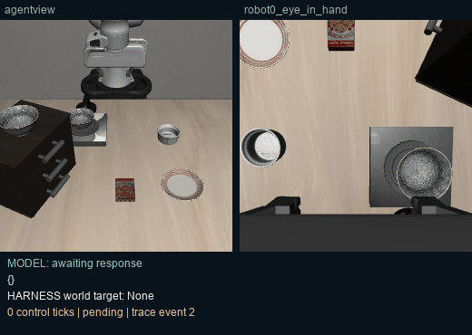
