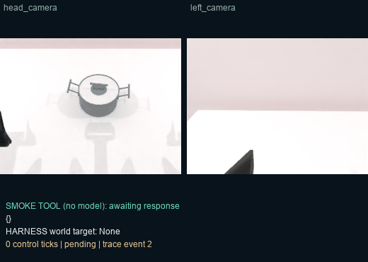
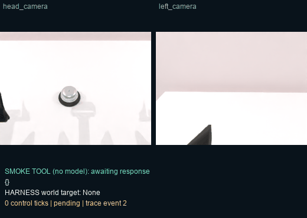
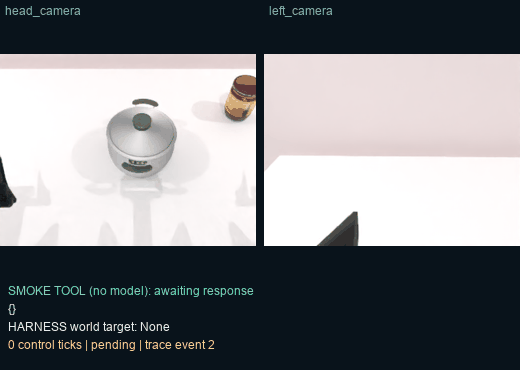

# GPU interface checks

Actual one-RTX-4090 runs. Three RoboTwin cases passed. RoboCasa failed in three asset-setup attempts (nine cases); failures are retained in [all attempts](all-attempts.json). A 2cm TCP command is checked at a 12mm tolerance; this is not precision grasping or task completion.

### robotwin-lift_pot-s0

Interface passed: True. 1 native EE action call; the native action performs multiple internal physics steps. **No GPT task-solving claim.**

[Interactive trace](six-smokes-run1--robotwin-lift_pot-s0/index.html)

### robotwin-click_bell-s0

Interface passed: True. 1 native EE action call; the native action performs multiple internal physics steps. **No GPT task-solving claim.**

[Interactive trace](six-smokes-run1--robotwin-click_bell-s0/index.html)

### robotwin-move_can_pot-s0

Interface passed: True. 1 native EE action call; the native action performs multiple internal physics steps. **No GPT task-solving claim.**

[Interactive trace](six-smokes-run1--robotwin-move_can_pot-s0/index.html)
